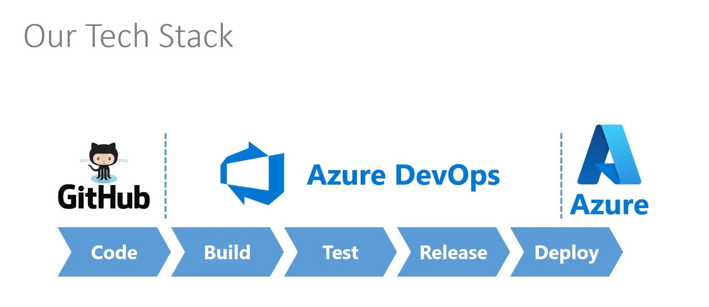

# The .NET Developer Toolkit


## Definition
* Dependency Injection is a pattern
* "ASP.NET Core supports the dependency injection (DI) software design pattern, which is a technique for achieving Inversion of Control (IoC) between classes and their dependencies."
* Repository Pattern: Easy form to change the data base to use in your application
  * Repositories encapsulate data access implementation
  * Decouple implementation / technology from the domain model
  * AppDbContext: EntityFrameworkCore concept. Connect Models with SQL
* DTOs Data Transfer Objects
* Object Mapping
* Docker 
  * Containerization platform
  * Build your application into images
  * Run them as containers
  * App Virtualiziation. Not OS Virtualization (VMs)
* CI/CD
  * CI - Continuous Integration
    * Taking code from 1 or more developers, build and testing to ensure that those changes will not break the build
    * Triggered when developers checkin changes to a repository
  * CD - Continuous Delivery
    * Automating release process
    * You can deploy changes 'pressing a button' - Manual
  * CD - Continuous Deployment
    * Code changes will make their way into production, without manual intervention

## Images


## Extra tools
* Postman
* Docker
* SQL management studio
* GitHub Cli


## Commands
```Bash
$ dotnet --version
#Update EntityFramework Tools
$ dotnet tool update  --global dotnet-ef
#
# 2. Dependency Injection
# -n to specify the Project name
$ dotnet new webapi -minimal -n DiApi
$ dotnet new webapi -minimal -n UserApi
# cd DiApi
$ dotnet watch
$ dotnet run
#
# 4. User Secrets
# Secrete storate
$ dotnet user-secrets init
$ dotnet user-secrets set "Password" "ususu"
# Path C:\Users\username\AppData\Roaming\Microsoft\UserSecrets\DDT-US_6f6f9190-95e9-4a80-9597-068cff308a02
# $ dotnet dev-certs https --trust
$ dotnet new console -n CommandConfig
$ dotnet add package Microsoft.Extensions.Hosting
$ dotnet user-secrets init
$ dotnet user-secrets set "Password" "user secrets password"
# C:\Users\username\AppData\Roaming\Microsoft\UserSecrets\DDT-CONSOLE_796f707c-506f-45f0-a9f2-a0530e4d1e6c
# 
# 5. Serializer
$ dotnet new console -n Serializer
# 
# 6. Deserializer
$ dotnet new console -n 6.Deserializer
# 
# 7. Scaffolding API
$ dotnet new webapi -minimal -n 7.WeatherAPI
# Extension: Past JSon as Code. Ctrl+Shift+P - Past Json as Code
#
# 8. The repository Pattern.
# Open Docker Desktop without Kubernets, or you machine will die
$ dotnet new webapi -minimal -n 8.CommandAPI
$ dotnet add package Microsoft.EntityFrameworkCore
$ dotnet add package Microsoft.EntityFrameworkCore.Design
$ dotnet add package Microsoft.EntityFrameworkCore.SqlServer
$ docker compose up -d
$ docker stop
$ dotnet ef migrations add initialmigration
$ dotnet ef database update
# To avoid error, change the connection string - Encrypt-False: '...por uma autoridade que não é de confiança' // Encrypt: https://stackoverflow.com/questions/17615260/the-certificate-chain-was-issued-by-an-authority-that-is-not-trusted-when-conn
$ dotnet add package Microsoft.Extensions.Caching.StackExchangeRedis
#
# 9. DTOs
$ dotnet new webapi -minimal -n 9.PersonAPI
$ dotnet add package Microsoft.EntityFrameworkCore
$ dotnet add package Microsoft.EntityFrameworkCore.Design
$ dotnet add package Microsoft.EntityFrameworkCore.SqlServer
$ dotnet ef migrations add initial_migration
$ dotnet ef database update
$ dotnet add package Automapper.Extensions.Microsoft.DependencyInjection
# Add house column
$ dotnet ef migrations add addhouse
$ dotnet ef database updated
$ dotnet ef migrations add addpoints
$ dotnet ef database updated
#
#10. Docker
$ wsl -l -v #Version of WSL. Docker will run under this
$ docker -v #Docker version
$ docker ps #Show all running container
$ docker stop [containerId] #stop specific container
#Setup SQL
$ docker run -e 'ACCEPT_EULA=Y' -e 'SA_PASSWORD=blabla@@333' -e 'MSSQL_PID=Express' -p 1433:1433 -d mcr.microsoft.com/mssql/server:2022-latest
#Project
$ dotnet new webapi -minimal -n 10.ToDoAPI
$ dotnet add package Microsoft.EntityFrameworkCore.InMemory
$ docker build -t <docker_hub_id>/todoapi . #docker build -t 22369/todoapi .
$ docker run -p 8080:80 22369/todoapi
$ docker login
$ docker push 22369/todoapi
# deploying in azure
# Certificate:
$ dotnet dev-certs https -ep C:\Users\rlins\.aspnet\https\10.ToDoAPI.pfx -p pa55w0rd!
$ dotnet dev-certs https --trust
$ dotnet user-secrets init
$ dotnet user-secrets set "Kestrel:Certificates:Development:Password" "pa55w0rd!"
$ docker build -t 22369/todoapi .
#
# Specify ports to work [-p 8080:80 -p 8081:443]
# Variables - URLs [-e https://+;http://+]
# Variables - Set port [-e ASPNETCORE_HTTPS_PORT=8081]
# Variables - Set Environment [-e ASPNETCORE_ENVIRONMENT=Development]
# User Secret [-v $env:APPDATA\microsoft\UserSecrets\:/root/.microsoft/usersecrets]
# User Secret [-v $env:USERPROFILE\.aspnet\https:/root/.aspnet/https/]
# Name of image to run - [22369/todoapi]
$ docker run -p 8080:80 -p 8081:443 -e ASPNETCORE_URLS="https://+;http://+" -e ASPNETCORE_HTTPS_PORT=8081 -e ASPNETCORE_ENVIRONMENT=Development -v $env:APPDATA\microsoft\UserSecrets\:/root/.microsoft/usersecrets -v $env:USERPROFILE\.aspnet\https:/root/.aspnet/https/ 22369/todoapi
$ dotnet add package Microsoft.EntityFrameworkCore
$ dotnet add package Microsoft.EntityFrameworkCore.SqlServer
$ dotnet add package Microsoft.EntityFrameworkCore.Design
$ dotnet ef migrations add initial
#
#11. Git
$ dotnet new console -n 11.PrintColour
$ dotnet new gitignore # gitignore to dotnet
$ git checkout -b <new-branch> | git branch <new-branch> #Create new branch
$ git branch -d <branch-to-delete> #delete local branch
#
#12.ToDoAPI
12.ToDoAPI\src>$ dotnet new webapi -minimal -n ToDoAPI
12.ToDoAPI\test>$ dotnet new xunit -n ToDoAPI.Tests
12.ToDoAPI>$ dotnet new sln --name ToDoAPISolution # Generate .sln file
12.ToDoAPI>$ dotnet sln ToDoAPISolution.sln add src/ToDoAPI/ToDoAPI.csproj
12.ToDoAPI>$ dotnet sln ToDoAPISolution.sln add test/ToDoAPI.Tests/ToDoAPI.Tests.csproj

12.ToDoAPI>$ dotnet add package Microsoft.EntityFrameworkCore
12.ToDoAPI>$ dotnet add package Microsoft.EntityFrameworkCore.Design
12.ToDoAPI>$ dotnet add package Microsoft.EntityFrameworkCore.InMemory


```

## Links:
* [Course](https://www.youtube.com/watch?v=Rqz9XiSqH3E)
* [.NET Developer Toolkit](https://lesjackson.net/course/dotnet-developer-toolkit)
* [Dependency injection in ASP.NET Core](https://learn.microsoft.com/en-us/aspnet/core/fundamentals/dependency-injection?view=aspnetcore-6.0)
* [ASP.Net Middleware](https://learn.microsoft.com/en-us/aspnet/core/fundamentals/middleware/?view=aspnetcore-7.0)
* [Azure Devops](https://azure.microsoft.com/en-gb/products/devops/)

